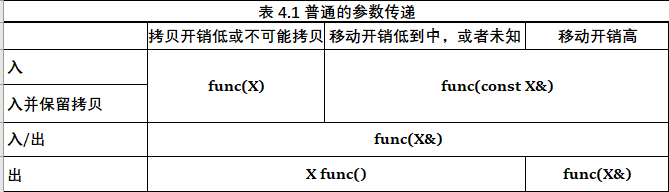
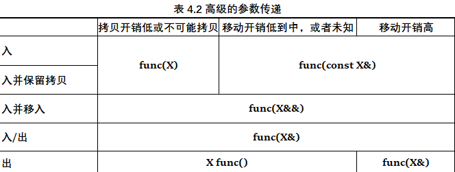
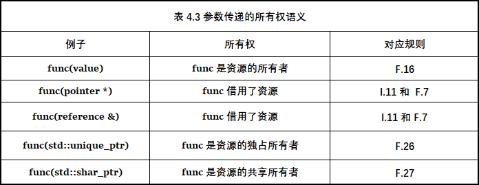
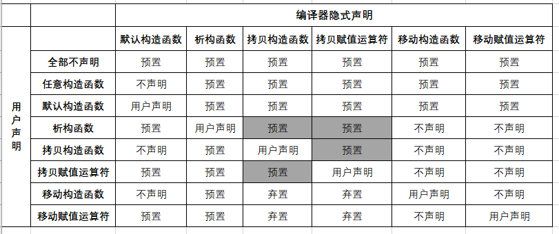

# 《C++ Core Guidelines Analysis》 学习笔记


- [3.2 运用依赖注入化解](#32-运用依赖注入化解)
- [3.3 构建良好的接口](#33-构建良好的接口)
  - [I.13 不要用单个指针来传递数组](#i13-不要用单个指针来传递数组)
  - [I.27 为了库 ABI 的稳定，考虑使用 PImpl 编程技巧](#i27-为了库-abi-的稳定考虑使用-pimpl-编程技巧)
- [4.1 函数定义](#41-函数定义)
  - [F.4 若函数有可能在编译期间求值，就将它用 `constexpr` 修饰](#f4-若函数有可能在编译期间求值就将它用-constexpr-修饰)
  - [F.6 若函数不抛异常，请使用 `noexcept` 关键字修饰](#f6-若函数不抛异常请使用-noexcept-关键字修饰)
- [4.2 参数传递：入与出](#42-参数传递入与出)
  - [F.16 对于"入"参，拷贝开销低的按值传递，其他类型按 `const` 引用来传递](#f16-对于入参拷贝开销低的按值传递其他类型按-const-引用来传递)
  - [F.19 对于 “转发” 参数，使用移动语义来传递，并且只 `std::forward` 该参数](#f19-对于-转发-参数使用移动语义来传递并且只-stdforward-该参数)
  - [F.21 要返回多个 “出” 值，优先考虑返回结构体或者元组](#f21-要返回多个-出-值优先考虑返回结构体或者元组)
- [4.3 参数传递：所有权语义](#43-参数传递所有权语义)
  - [F.42 返回指针（仅仅）用于表示位置](#f42-返回指针仅仅用于表示位置)
  - [F.44 当不希望发生拷贝，也不需要表达 “没有返回对象” 时，应该返回引用](#f44-当不希望发生拷贝也不需要表达-没有返回对象-时应该返回引用)
- [第 5 章：类和类层次结构](#第-5-章类和类层次结构51--52-的内容个人已经掌握因此不在本文档赘述)
  - [5.3 构造函数，赋值运算符 和 析构函数](#53-构造函数赋值运算符-和-析构函数)
    - [C.20 如果能避免定义默认操作，就这么做](#c20-如果能避免定义默认操作就这么做)
    - [C.21 若 定义或 `=delete` 了任何默认操作，就对所有默认操作都就行了定义或 `=delete`](#c21-若-定义或-delete-了任何默认操作就对所有默认操作都就行了定义或-delete)
    - [C.22让默认操作保持一致](#c22-让默认操作保持一致)
    - [C.42 若构造函数无法构造出有效对象，则应该抛出异常](#c42-若构造函数无法构造出有效对象则应该抛出异常)
    - [C.45 不要定义仅初始化数据成员的默认构造函数，而应该使用成员初始化器（C++11）](#c45-不要定义仅初始化数据成员的默认构造函数而应该使用成员初始化器c11)
    - [C.46 默认情况下，把单参数的构造函数声明为 `explicit`](#c46-默认情况下把单参数的构造函数声明为-explicit)

## 3.2 运用依赖注入化解

下面是一个很简单的日志器切换，可以这么实现

```C++
#include <chrono>
#include <iostream>
#include <memory>

/*
    这个程序演示了如何使用依赖注入替换一个日志记录器，他的类关系如下：

    抽象基类 Logger 公共派生出 SimpleLogger 类 和 TimeLogger 类
    前者单纯的输出一条日志，后者在输出时需要带上时间信息。
*/

class Logger
{
    public:
        /**
         * @brief 向终端，或某个文件输出一条日志信息。
         * 
         * @param __mess 传入的日志信息
         * 
         * @return non-return
        */
        virtual void write(const std::string & __mess) = 0;            // 纯虚函数
        virtual ~Logger() = default;
};

class SimpleLogger : public Logger
{
    private:
        /**
         * @brief 向终端，或某个文件输出一条日志信息。（重载于 Logger 类方法）
         * 
         * @param __mess 传入的日志信息
         * 
         * @return non-return
        */
        void write(const std::string & __mess) override
        {
            std::cout << __mess << std::endl;
        }
};

class TimeLogger : public Logger
{
    private:

        /*
            自定义持续时间类型 MySecondTick
            是 std::chrono::duration<long double> 类型
        */
        using MySecondTick = std::chrono::duration<long double>;

        /**
         * @brief 获取当前时间距离 UNIX 纪元的时间差。
         * 
         * @return 当前时间距离 UNIX 纪元的时间差
        */
        long double timeSinceEpoch()
        {
            /*获取当前系统时间点*/
            auto timeNow = std::chrono::system_clock::now();

            /*
                获取当前时间距离 UNIX 纪元的 
                std::chrono::_V2::system_clock::duration 对象。
            */
            auto duration = timeNow.time_since_epoch();

            /*
                将该对象转换成 long double 类型
            */
            MySecondTick second(duration);

            /*返回秒数*/
            return second.count();
        }

        std::string currentTime()
        {
            /*获取当前系统时间点*/
            const auto timeNow = std::chrono::system_clock::now();
            
            /*将当前时间转换成 time_t 类型，一个有符号的长长整型*/
            const std::time_t currentTime = std::chrono::system_clock::to_time_t(timeNow);

            /*最后将这个 time_t 类型转换成当前系统时间的字符串，并传给 std::string 去构建并返回（移动而非拷贝）*/
            return std::string(std::ctime(&currentTime));
        }

        void write(const std::string & __mess) override
        {
            /*强制使用定点表示法*/
            std::cout << std::fixed;

            /*输出带时间信息的日志信息*/
            std::cout << "Time since epoch: " << timeSinceEpoch() << ": " << __mess << '\n';
            std::cout << "Current system time: " << currentTime() << std::endl;
        }
};

class Client
{
    private:
        /*一个指向了 Logger 类的智能指针*/
        std::shared_ptr<Logger> logger;

    public:
        /*构建函数初始化 logger 指针*/
        Client(std::shared_ptr<Logger> log) : logger(log) {}

        /*输出日志*/
        void doSomeThing() { logger->write("Message"); }

        /*
            改变 Logger 的类型，
            所有日志类都由 Logger 抽象类派生而来，可以随意切换
        */
        void setLogger(std::shared_ptr<Logger> log) { logger = log; }
};
```

由代码可见，所有的日志器类均派生自抽象类 `Logger`，因此可以很安全的进行类型转换（即抽象父类转换成其子类）。
这样就可以在使用中随意切换日志的类型，而且在后续的开发和维护中，可以非常方便的新增其他类型的日志器。
如下面代码所示：

```C++
int main(int argc, char const *argv[])
{
    std::cout << std::endl;

    /*使用 make_shared 而不是 new 实例化，更安全*/
    Client clineA(std::make_shared<SimpleLogger>());
    /*普通日志，只能单纯的输出一条日志*/
    clineA.doSomeThing();

    /*切换成带时间的日志*/
    clineA.setLogger(std::make_shared<TimeLogger>());
    clineA.doSomeThing();
    clineA.doSomeThing();

    std::putchar('\n');
    
    return EXIT_SUCCESS;
}
```

## 3.3 构建良好的接口

Scott Meyers 对于如何构建良好的接口做出如下总结：

> 让接口易于正确使用，难以错误使用。

因此，本书建议在编写接口时，应该遵循如下规则：

- 接口明确（接口名要尽可能符合这个接口所执行的操作）
- 接口精确并具有强类型 （不要滥用 auto 关键字，有些时候可以用泛型代替）
- 保持较低的参数数目（没有人希望看到有 100 个形式参数的接口）
- 避免相同类型却不相关的参数相邻

下面是两种不同的求容器内所有字符串元素之和的算法

```C++
#include <algorithm>
#include <vector>
#include <iostream>
#include <numeric>
#include <execution>

/**
 * @brief 使用循环来 串行的求取 vector 内所有字符串的长度之和，这种方法易于理解，
 * 但数据量大起来就歇菜了。
 * 
 * @param __strVec 传入的源 std::vector
 * 
 * @return vector 内所有字符串的长度之和
*/
size_t getLengthCount(std::vector<std::string> & __strVec);

/**
 * @brief 使用 std::transform_reduce 和并行策略（std::execution::par）来求取 vector 内所有字符串的长度之和。
 * 这种方法在数据量较大时非常有效。此外，为了安全起见，使用了函数模板提高安全性，避免滥用 auto。
 * 
 * @param __strVec      传入的源 std::vector
 * @param __add         计算的规则
 * @param __eachLength  返回每个字符串之长
 * 
 * @return vector 内所有字符串的长度之和
*/
template <typename Add, typename LengthFunc>
size_t getLengthCount(std::vector<std::string> & __strVec, Add __add, LengthFunc __eachLength);

size_t getLengthCount(std::vector<std::string> & __strVec)
{
    size_t result = 0;

    for (auto elementString : __strVec) { result += elementString.size(); }

    return result;
}

template <typename Add, typename LengthFunc>
size_t getLengthCount(std::vector<std::string> & __strVec, Add __add, LengthFunc __eachLength)
{
    /*
        std::execution::par 可以指示该算法利用多核心 CPU 资源，并行地处理多个数据。
        初始值 std::size_t{0} 表示 reduce 操作的初始结果为 0。
    */
    return std::transform_reduce(std::execution::par, __strVec.begin(), __strVec.end(), std::size_t{0}, __add,  __eachLength);
}
```

`getLengthCount` 的第一个版本非常好理解，但是在面对大量数据的时候会有性能问题。

而该函数的第二个版本则使用 使用 `std::transform_reduce` 和并行策略（`std::execution::par`）提高了性能，以应对数据量大的情况。孰优孰劣一目了然。

下面是测试用例，结果都相同，在数据量不大的情况下不怎么能体现第二个版本的优越性（逃）。

```C++
int main(int argc, char const *argv[])
{
    std::vector<std::string> stringVector = {"Only", "testing", "pourpose"};

    printf("The sum of string lengths inside the container = %zd.\n", getLengthCount(stringVector));

    printf("The sum of string lengths inside the container = %zd.\n", 
            getLengthCount(stringVector, 
                           [](size_t __a, size_t __b) { return __a + __b; }, 
                           [](std::string __s) { return __s.size(); })
          );
          
    return EXIT_SUCCESS;
}
```

当然，对于字符串大小写转换等操作，也可以用 STL 算法去取代循环，提升可读性和安全性，如下面的代码所示：

```C++
/**
 * @brief 1. 单输入范围，单输出范围。
 * 对 begin - end 范围内的数据应用 operation 操作，将结果输出到 out 中（本函数是输出回它自己）。
 * 这种操作可以用在字符串的大小写转换，甚至其他统一操作上，一行代码搞定。
 *
 * @param __str 要进行操作的字符串引用
 * @param __op  对字符串要执行的统一操作（可以是 Lamba 表达式，函数对象，函数指针）。
 *
 * @return non-return
 */
template <typename Operation>
void unifiedStringOperation(std::string &__str, Operation __op);

template <typename Operation>
void unifiedStringOperation(std::string &__str, Operation __op)
{
    std::transform(__str.begin(), __str.end(), __str.begin(), __op);
}
```

此外， `std::transform` 有 `3` 个重载版本，具体内容不在本文档赘述，请参考 `std_transform.cpp` 文件。

### I.13 不要用单个指针来传递数组

在 C++ 中有很多 STL 算法和容器能帮你优雅的解决数组传递的问题，比如

- `std::vector`
- `std::span`

`std::span` 是一个对象，它可以指代连续存储的一串对象，它永远不是所有者。而这段连续的内存可以是数组，或者带有大小的指针，也可以是 STL 容器，如下面的代码所示：

```C++
template <typename Type>
void copyContainer(std::span<const Type> __src, std::span<Type> __dest);

template <typename Type>
void copyContainer(std::span<const Type> __src, std::span<Type> __dest)
{
    if (__dest.size() < __src.size())
    {
        throw std::out_of_range("__dest is to small.");
    }

    auto destIterator = __dest.begin();

    for (const auto & element : __src) { *destIterator++ = element; }
}
```

`std::span` 可以自动推导连续容器（C 风格数组，`std::array`，`std::vector`，`std::string` 等）的大小，避免手动操作内存，增加了安全性。

但恕我直言，这有那么点多此一举，明明拷贝直接用 `std::copy` 就行了（笑哭）。

```C++
int main(int argc, char const *argv[])
{
    std::vector<int> srcVector = {1, 2, 3, 4, 5};
    std::vector<int> destVector(srcVector.size());

    auto printContent = [](const int & __n) { std::cout << __n << ' '; };

    //copyContainer(srcVector, destVector);

    std::copy(srcVector.begin(), srcVector.end(), destVector.begin());

    std::for_each(srcVector.begin(), srcVector.end(), printContent); std::putchar('\n');
    std::for_each(destVector.begin(), destVector.end(), printContent);

    return EXIT_SUCCESS;
}
```

### I.27 为了库 ABI 的稳定，考虑使用 PImpl 编程技巧

使用 PImpl（Pointer to implementation 指向实现的指针） 编程技巧，将实现的细节放在另一个类上，从而将其从类中移除。
也就是将接口和数据解耦，用户无需关心接口的参数和实现过程。

这么做的原因是：

- 私有数据成员会参与类的内存布局，而私有函数成员会重载决策，这些依赖意味着对成员实现细节的修改会导致所有类的用户都需要重新编译。

这样做的好处有:

- 隐藏了实现细节，类的接口更清晰
- 可以独立改变实现而不影响接口
- 可以减少编译依赖，加快编译速度

持有指向实现的指针（PImpl）的类可将用户隔离在类实现的变化之外，而代价是多了一次间接访问。

下面演示一个简单的，使用了 PImpl 编程技巧的 Widget(小组件) 类:

```C++
/*接口 Widget.h*/
#include <iostream>
#include <algorithm>
#include <memory>

class Widget
{
    private:
        /*创建一个名为 impl 的类，具体实现放在外部*/
        class impl;

        /*
            再创建一个 impl 类型的唯一指针 pimpl，
            所有类的成员方法都要通过这个智能指针去间接访问 impl 类中的数据或接口。
        */
        std::unique_ptr<impl> pimpl;

    public:
        Widget(int __n);  /*构建函数，定义在实现文件中*/

        void draw();      /*公共接口 draw，将会转发给实现*/

        /*
            由于没有声明裸指针或其他复杂的数据，
            所以使用默认的 移动构造函数 和 移动语义 即可。
        */
        Widget(Widget &&) = default;
        Widget & operator=(Widget &&) = default;

        /*禁用 拷贝构造函数 和 拷贝运算符，转而使用移动构造函数*/
        Widget(const Widget &) = delete;
        Widget & operator=(Widget &) = delete;

        /*
            由于没有声明裸指针或其他复杂的数据，
            使用默认析构函数即可。
        */
        ~Widget() = default;
};

/*impl 类的具体实现*/
class Widget::impl
{
    private:
        int data;
    
    public:
        impl(int __n) : data(__n) {}

        /*收到来自 Widget 类对象的转发，才会调用 draw 输出信息。*/
        void draw(const Widget & __w) { std::printf("Drwa data: %d.\n", data); }
};
```

```C++
/*实现 Widget.cpp*/
#include "./Widget.h"

/*
    调用 std::unique_ptr<impl> 的构建函数，
    并使用 std::make_unique<impl>(__n) 去实例化 impl 类，
    参数 __n 会作为 Widget::impl 类构建函数的参数去创建这个类。

    这样我们在实例化 Widget 类的时候，也实例化了 Widget::impl 类，
    并使用一个唯一指针去指向它。 
*/
Widget::Widget(int __n) : pimpl(std::make_unique<impl>(__n)) {}

/*
    Widget::draw() 会通过智能指针 pimpl 调用 Widget::impl::draw，
    并传入 Widget 类对象它本身。
*/
void Widget::draw() { pimpl->draw(*this); }
```

```C++
/*测试用例*/
#include "./Widget.h"

int main(int argc, char const *argv[])
{
    Widget widgetA(12);
    Widget widgetB(21);

    /*
        使用这个类的人不需要关系这个接口需要什么参数和以及具体的实现过程。
        成功的将数据和接口解耦，即便实现的细节有所变化，使用者也不必担心。
    */
    widgetA.draw();
    widgetB.draw();

    /*使用移动语义，将 B 的所有权转让给 A*/
    widgetA = std::move(widgetB);


    widgetA.draw();

    /*此时 B 就 "悬空" 了，在重新构建它之前，不能再调用它*/
    //widgetB.draw();

    /*重新构建 widgetB 对象*/
    widgetB = Widget(123);

    widgetB.draw();

    return EXIT_SUCCESS;
}
```

## 4.1 函数定义

给函数取个好名字自然不用多说，大致可以遵循以下规则：

- 可以取名为 `verbObject`（即动词加名词的形式）
- 如果是类方法，直接用动词就行了（如 `display`，`draw` 等），因为该函数已经对这个对象进行了操作。

此外，函数的功能要尽量精简和单一，最好不要让一个函数干很多的事情，也不要写出一个超级庞大的函数，这都不利于后续的开发与维护。

### F.4 若函数有可能在编译期间求值，就将它用 `constexpr` 修饰

`constexpr` 函数是可能在编译期间运行的函数。
当在常量表达式中调用该关键字修饰的函数时，或者用一个该关键字修饰的变量来获取 `constexpr` 函数的返回值时，它会在编译期运行。
也可以用只能在运行期求值的参数来调用 `constexpr` 函数，这种函数是隐含内联的。

`constexpr` 函数的返回值通常会被标记为只读的（存放在只读/静态存储区），且该关键字修饰的函数具有以下的好处：

- 性能更好
- 在编译期求值的 `constexpr` 函数 是纯函数，因此是线程安全的，可以并行执行。

这里有必要详细说明一下，何为 “纯函数”，一般一个函数只要符合以下特征，就可以认为是纯函数：

- 相同的输入，总是产生相同的输出
  - 纯函数对于同样的输入参数，必须返回同样的结果

- 函数内部不改变参数的值
  - 纯函数不能改变传入参数的值，也不能改变外部状态,如修改全局变量、静态变量、参数变量或引用等，即不产生副作用

- 不依赖外部状态,只依赖输入参数
  - 纯函数的执行只依赖于输入参数,而与外部状态无关

基于上述特征，纯函数就可以：

- 孤立的测试
- 孤立的验证或者重构
- 缓存其结果
- 被自动的重排或者在其他线程上执行

而像 `random()` `time()` 这样的函数就是不纯的，他们会在不同的调用中返回不同的结果。（与函数体之外的状态交互的函数是不纯的）

接下来用 gcd 算法为例，演示编译期求值的例子：

```C++
/**
 * @brief 以辗转相除法的实现为例，
 * 可以使用 constexpr 关键字修饰该函数，让它在编译期内求值。
 * 
 * @param __a 整数 A
 * @param __b 整数 B
 * 
 * @return A 和 B 的最大公约数
*/
constexpr auto gcd(int __a, int __b);

constexpr auto gcd(int __a, int __b)
{
    while (__b != 0)
    {
        auto t = __b;
        __b = __a % __b;
      
        __a = t;
    }

    return __a;
}
```

显然，这个函数是符合纯函数的定义的，下面是测试用例：

```C++
int main(int argc, char const *argv[])
{
    /*使用 constexpr 让 gcd 在编译期运行，变量 result 是只读的，不容修改。*/
    constexpr int result = gcd(11, 121);

    int a = 11, b = 121;

    /*正常运行*/
    int resultB = gcd(a, b);

    printf("%d %d", result, resultB);

    return EXIT_SUCCESS;
}
```

### F.6 若函数不抛异常，请使用 `noexcept` 关键字修饰

通过将函数声明为 `noexcept`，可以禁止该函数抛出异常。noexcept 关键字在该语境下意味着：“老子不在乎异常”。

其原因可能是：

- 程序员无法对这个异常做出反应，这种情况下就只能调用 `std::terminated()` 去强行终止程序。

此外，以下类型的函数永远都不要抛异常（*注意：不是不能抛异常，即便抛了你也处理不了*）：

- 默认构建，构建，析构 函数
- 移动操作函数
- `swap` 函数

下面演示一个使用了 `noexcept` 的函数，它会在内存耗尽时崩溃：

```C++
/**
 * @brief 从标准输入流（通常是键盘）中读取数据并存入这个字符串 vector 中，
 * 该函数会在内存耗尽时崩溃。
 * 
 * @param __is 标准输入流的引用
 * 
 * @return 完成输出后返回的字符串 vector
*/
std::vector<std::string> collect(std::istream & __is) noexcept;

std::vector<std::string> collect(std::istream & __is) noexcept
{
    std::vector<std::string> result;
    
    /*
        若传入的输入流是 std::cin，即重定向到键盘，
        在循环内没有使用 break continue 关键字的话，该循环就是死循环。

        若传入的是一个文件 std::ifstream 或者别的程序（pipe），且数据量足够大时，也会因为内存耗尽奔溃。
    */
    for (std::string s; std::getline(__is, s);)
    {
        //if (s == "quit") { break; }
        result.push_back(s);
    }

    //while (std::getchar() != '\n') { continue; }
    
    return result;
}
```

下面是测试用例，由于传入 `std::cin` 会导致 `collect` 函数进入死循环，所以注释了：

```C++
/*测试用例*/
int main(int argc, char const *argv[])
{
    /*以只读模式打开某个文本文件*/
    std::ifstream targetFileRead("./data/target.txt", std::ios_base::in);

    auto showContent = [](const std::string & __s) -> void { std::cout << __s << '\n'; };
    
    /*从文本文件中读取数据到 字符串数组中*/
    std::vector<std::string> stringSetA = collect(targetFileRead);
    //std::vector<std::string> stringSetB = collect(std::cin);

    /*输出内容*/
    std::for_each(stringSetA.begin(), stringSetA.end(), showContent);
    //std::for_each(stringSetB.begin(), stringSetB.end(), showContent);

    return EXIT_SUCCESS;
}
```

## 4.2 参数传递：入与出

本书总结了一张表格，它提供一个概览，介绍了函数中传入和传出信息的各种方式：


*该表的表头描述了数据在拷贝和移动开销方面的特征，而各行则表明了参数的传递方向*

- 数据类型

  - 拷贝开销低或不可能拷贝：`int` 或 `std::unique_ptr`
  - 移动开销低：`std::vector<T>` 或 `std::string`
  - 移动开销中：`std::array<std::vectro>` 或 `BigPOD`（Plain Old Data，即简旧数据 —— 没有析构/构建函数以及虚成员函数的类）
  - 移动开销未知：模板
  - 移动开销高：`BigPOD[]` 或者 `std::array<BigPOD>`

- 参数的传递方向

  - 入：输入参数
  - 入并保留"拷贝"：被调用者保留一份数据
  - 入/出：参数会被修改
  - 出：输出参数

总结下来，对几个 `int` 大小的数据操作是低开销的；在不进行内存分配的前提下，1000 字节左右的操作都属于低开销。

*表 4.1 中普通的参数传递规则应该是用户的首选。不过，也有高级的参数传递规则，实际上就是加入了 "入并移入" 的语义。*



在 "入并移入" 调用后，参数处在所谓的被移动上面，这就意味这它处于合法但未定义的状态。所以，在对这个对象进行调用前，必须先初始化。

### F.16 对于"入"参，拷贝开销低的按值传递，其他类型按 `const` 引用来传递

默认情况下，值能拷贝就拷贝。如果拷贝开销大，就按 `const` 引用传递。本书总结两条规则，用于判断对象拷贝的开销高低。

- 若 `sizeof(param)  <= 2 * sizeof(void*)`，则按值传递参数
- 若 `sizeof(param)  > 2 * sizeof(void*)`，则按 `const` 引用传递参数。

下面的函数，数据的传递方式不同，开销也不同：

```C++
/*
    按 `const` 引用传递参数，总是低开销。
*/
void functionA(const std::string & __s);

/*
    按值传递，期间会经过一次拷贝构造函数，有潜在的开销（比如一个超长的字符串）。
*/
functionB(std::string __s);

/*
    按值传递，但只拷贝了一个 4 字节的整数，开销忽略不计。
*/
functionC(int __x);

/*
    按 `const` 引用传递参数，在函数内访问有额外开销。

    引用需要在内存中创建别名或符号,这需要额外时间和空间。
    传值只是拷贝值,没有别名的开销。
    const 引用无法优化。编译器无法对 const 引用进行如 RVO, NRVO 等返回值优化,会产生额外的拷贝或移动开销。

    所以对于这种很小的数据，按值传递就行了。
*/
functionD(const int & __x);
```

### F.19 对于 “转发” 参数，使用移动语义来传递，并且只 `std::forward` 该参数

有时用户想完美的转发参数 param，意味着要保持左值的左值性，以及右值的右值性，这样才能 “完美” 地转发参数，使它的语义不变。
转发参数的典型用例是工厂函数，它通过调用某个用户指定对象的构造函数创建出该对象。用户不知道参数是不是右值，也不知道函数需要多少参数，如下面的函数所示：

```C++
// forwarding.cpp
#include <utility>

/**
 * @brief 使用 std::forward 对用户传入的参数进行完美转发（即保持左值的左值性，以及右值的右值性）
 * 
 * @tparam Type~TypeN 使用形参包，可以将 n 个数据打包。
 * 
 * @param  typeN     用户传入的 n 个数据的右值引用，都会通过形参包打包。
 * 
 * @return 将形参包中的数据全部解包，转发到某个类型的构建函数中，构造出一个临时对象，最后通过移动语义返回。
*/
template <typename Type, typename ... TypeN>
Type create(TypeN && ... typeN)
{
    return Type(std::forward<TypeN>(typeN)...);
}
```

该函数通过：

- 变长参数模板
- `std::forward()` 完美转发
- 移动语义优化

使得它可以高效地将任意数量和类型的参数完美转发给返回类型的构造函数。
下面是测试用例：

```C++
// Forwarding\forwarding.cpp
#include <iostream>

struct MyType
{
    private:
        int count;
        double score;
        bool ifValue;

    public:
        MyType(int __c, double __s, bool __ifVal) : count(__c), score(__s), ifValue(__ifVal) {}

        friend std::ostream & operator<<(std::ostream & __os, struct MyType & myType);

};

std::ostream & operator<<(std::ostream & __os, struct MyType & myType)
{
    __os << myType.count << '\t' << myType.score << '\t' << ((myType.ifValue) ? "true" : "false") << '\n';

    return __os;
}

/*测试用例*/
int main(int argc, char const *argv[])
{
    int myTypeCount = 25;
    // 转发 3 个参数，构建后返回：（左值，右值，右值）
    MyType myType = create<MyType>(myTypeCount, 88.60, true);

    long double decimal = 3.1415926535;
    // 转发 1 个参数：（左值）
    long double myDecimal = create<long double>(decimal);

    // 转发 1 个参数：（右值）
    int myInteger = create<int>(114514);

    // 无参转发，结果为 0
    int empty = create<int>();

    std::cout << myType;
    std::cout << myDecimal << '\t' << myInteger << '\t' << empty << '\n';
    
    return EXIT_SUCCESS;
}
```

这种结合了 变长参数模板，`std::forward()` 完美转发，移动语义优化的工厂函数是 C++ 典型的创建模式，下面是 std::make_unique 的一种可能的实现：

```C++
// std::make_unique 一种可能的实现，Forwarding\make_unique.cpp
namespace myStd
{
    /**
     * @brief make_unique 一种可能的实现，利用变长参数模板，std::forward 完美转发，以及移动语义优化。
     * 
     * @tparam Type 传入参数的类型，使用形参包打包。
     * 
     * @param __args 用户传入的参数，被形参包打包。
     * 
     * @return 解包形参包，通过 std::forward 转发到 Type 类型的构建函数中，构造出一个匿名临时对象，
     * 利用 new 关键在在堆中创建该对象，以移动语义转移所有权给 std::unique_ptr<Type> 的构造函数，
     * 构造出一个 std::unique_ptr<Type> 类型的对象，最后返回 std::unique_ptr<Type> 类型的对象，去动态的管理所创建的 Type 对象。
    */
    template <typename Type, typename ... Args>
    std::unique_ptr<Type> make_unique(Args&& ... __args)
    {
        return std::unique_ptr<Type>(new Type(std::forward<Args>(__args)...));
    }
};
```

以及测试用例，使用这个 `make_unique` 去创建一个唯一智能指针动态管理一个 `std::vector<int>`：

```C++
// Forwarding\make_unique.cpp
int main(int argc, char const *argv[])
{
    const std::vector<int> a = {345, 134, 13, 254, 3, 476536, 235};
    std::unique_ptr<std::vector<int>> vectorPointer = myStd::make_unique<std::vector<int>>(a);

    std::for_each(vectorPointer->begin(), vectorPointer->end(), [](const int __n) { printf("%d ", __n); }); puts("");

    vectorPointer->at(1) = 431;

    std::for_each(vectorPointer->begin(), vectorPointer->end(), [](const int __n) { printf("%d ", __n); });

    return EXIT_SUCCESS;
}
```

### F.21 要返回多个 “出” 值，优先考虑返回结构体或者元组

在 C 语言中，返回多个值，一般只能返回：数组，字符串，结构体，而且一般只返回它们的指针。这里演示结构体的返回：

```C
// returnPair/std_tuple.cpp

#include <stdio.h>
#include <stdlib.h>
#include <string.h>

struct myStruct 
{
    int count;
    double price;
    char describe[25];
};

/**
 * @brief 输出结构体的内容
 * 
 * @param __myStruct 传入的非空结构体
 * 
 * @return non-return
*/
void showStructContent(const struct myStruct * __myStruct)
{
    if (!__myStruct) { return; }

    printf("%d\t%lf\t%s\n", __myStruct->count, __myStruct->price, __myStruct->describe);
}

/**
 * @brief           创建新结构体并返回这个结构体的指针
 * 
 * @param __c       数量
 * @param __p       价格
 * @param __desc    物品描述
 * 
 * @return          新结构体的指针
*/
struct myStruct * createStructData(int __c, double __p, const char * __desc)
{
    struct myStruct * newStruct = (myStruct *)malloc(sizeof(myStruct));

    if (!newStruct) { return NULL; }

    newStruct->count = __c;
    newStruct->price = __p;
    strcpy(newStruct->describe, __desc);

    return newStruct;
}

/**
 * @brief               修改结构体内的数据
 * 
 * @param __c           数量
 * @param __p           价格
 * @param __desc        物品描述
 * @param __beModify    要进行修改的目标结构体指针
 * 
 * @return              返回修改后的结构体指针
*/
struct myStruct * modifyStructData(int __c, double __p, const char * __desc, struct myStruct * __beModify)
{
    if (!__beModify) { return NULL; }

    __beModify->count = __c;
    __beModify->price = __p;
    strcpy(__beModify->describe, __desc);

    return __beModify;
}

int main(int argc, char const *argv[])
{
    struct myStruct *newShop = createStructData(1000, 90.05, "Phone");

    showStructContent(newShop);

    modifyStructData(98, 15.50, "Apple", newShop);

    showStructContent(newShop);

    free(newShop);

    return EXIT_SUCCESS;
}
```

而到了 C++，就有更加先进的方法来返回多个数据。比如在 C++11 版本引入的元组 `tuple` 和 C++17 引入的结构化绑定。

```C++
// returnPair/std_tuple.cpp

#include <iostream>
#include <tuple>

/**
 * @brief               传入一些数据，将这些数据组装成一个元组并返回
 * 
 * @param __c           数量
 * @param __p           价格
 * @param __desc        物品描述
 * 
 * @return              返回这些数据组装成的元组
*/
auto returnTuple(int __c, double __p, std::string __desc)
{
    /*
        使用 std::tie 将传入的数据打包成一个元组并返回。
    */
    return std::tie(__c, __p, __desc);
}

int main(int argc, char const *argv[])
{
    /*将 3 个数据打包成元组返回给 newTuple*/
    auto newTuple = returnTuple(19, 18.50, "Potato");

    /*使用结构化绑定（C++17）拆包 newTuple 元组*/
    auto [count, price, describe] = newTuple;

    /*输出*/
    std::cout << count << ' ' << price << ' ' << describe << '\n';
    
    return EXIT_SUCCESS;
}
```

## 4.3 参数传递：所有权语义

除了考虑参数流动的方向，还需要考虑参数传递的过程中，所有权的变化，如表 4.3 所示：



- `func(value):` 函数 `func` 自己有一份 `value` 的拷贝，因此它是参数的所有者。在函数运行结束后会自动销毁参数。
- `func(pointer *):` 函数 `func` 借用了资源，因此无权删除该资源。函数在每次使用前都会检查入参是否为空。
- `func(reference &):` 函数 `func` 借用了资源。和指针不同，引用的值总是合法的。
- `func(std::unique_ptr):` 函数 `func` 是参数的所有者，调用函数会自动把所有权转给 `std::unique_ptr` 去动态管理。且在函数运行结束后会自动销毁参数。
- `func(std::shar_ptr):` 函数 `func` 是参数的额外所有者。该函数会延长资源的生存期。在函数调用结束且是最后一个持有这片内存的分享指针，会自动销毁该参数。

下面是所有权语义在实践中的五大变体：

```C++
// ownerShipSemantic.cpp

#include <iostream>
#include <memory>
#include <utility>

/**
 * 设计一个简单的类，在析构的时候会输出这个类的信息。
*/
class MyString
{
    private:
        std::string myString;

    public:
        explicit MyString(std::string & __s) : myString(__s) {}

        ~MyString()  { printf("destroy object: %s\n", myString.c_str()); }
};

/*传值*/
void functionCopy(MyString __myString) {}

/*传指针*/
void functionPointer(MyString * __myString) {}

/*传引用*/
void functionReference(MyString & __myString) {}

/*通过 std::unique_ptr 传递*/
void functionUniquePointer(std::unique_ptr<MyString> __myStringUniquePtr) {}

/*通过 std::shared_ptr 传递*/
void functionSharedPointer(std::shared_ptr<MyString> __myStringSharedPtr) 
{ 
    printf("There are currently [%ld] shared_ptrs pointing to this piece of memory\n", __myStringSharedPtr.use_count()); 
}

int main(int argc, char const *argv[])
{
    puts("Program Begin: ");

    std::string smallyA = "114514";
    std::string smallyB = "1919810";
    std::string smallyC = "Fuck You!";

    /*
        初始化列表初始化（C++11）
        myString 在 main 中被声明，它会在 main 函数结束后被析构。
    */
    MyString myString{smallyA};
    
    /*myStringPointer 拿到 myString 的地址*/
    MyString *myStringPointer = &myString;

    /*myStringReference 与 myString 绑定*/
    MyString &myStringReference = myString;

    /*创建一个对象由唯一指针 myStringUniquePtr 动态管理*/
    auto myStringUniquePtr = std::make_unique<MyString>(smallyB);

    /*创建一个对象由分享指针 myStringSharedPtr 动态管理*/
    auto myStringSharedPtr = std::make_shared<MyString>(smallyC);

    /*
        按值传递，调用该函数会将 myString 拷贝给 __myString，
        __myString 的声明周期仅限这个函数，因此会在调用结束后输出 destroy object: 114514
    */
    functionCopy(myString);

    /*
        按指针传递，仅仅传递了 myString 对象的地址，不涉及拷贝或移动。
        所以这个函数无权销毁指向的对象，故不会输出信息。
    */
    functionPointer(myStringPointer);

    /*
        按引用传递，和传指针类似，也只是借用了资源，不涉及拷贝或移动。
        所以这个函数无权销毁所绑定的对象，故不会输出信息。
    */
    functionReference(myStringReference);

    /*
        使用 std::move 转移 myStringUniquePtr 的所有权给 __myStringUniquePtr
        而 __myStringUniquePtr 的生命周期仅限这个函数，因此会在调用结束后输出 destroy object: 1919810
    */
    functionUniquePointer(std::move(myStringUniquePtr));

    /*
        将 myStringSharedPtr 的拷贝传递给 __myStringSharedPtr，涉及到了构建，
        但是由于 shared_ptr 的特性，此时一共有 2 个 分享指针指向了同一片内存，算是给这片内存 "续命" 了。
        函数调用后输出：There are currently [2] shared_ptrs pointing to this piece of memory
    */
    functionSharedPointer(myStringSharedPtr);

    puts("Program End: ");
    return EXIT_SUCCESS;
}
/*
    在 main 函数结束后 myStringSharedPtr 和 myString 的声明周期才算彻底结束，故调用析构函数输出：
    destroy object: Fuck You!
    destroy object: 114514
*/
```

### F.42 返回指针（仅仅）用于表示位置

指针仅仅用于表示一片数据在计算机中的位置，像很多搜索功能的函数（如 `strchr`，或者链表等数据结构的 `Find_Node` 函数）

```C++
// src\linkList\Link_List.cpp
/**
 * @brief 查询目标单向链表中是否含有目标值的节点，若有则返回该节点的地址，若没有则返回空。
 * 
 * @param __head_node  链表头节点指针的引用
 * @param __find_value 要查询的目标值
 * 
 * @return 若有则返回该节点的地址，若没有则返回空
*/
List_Node * Find_Node(List_Node * &__head_node, const int __find_value);

List_Node * Find_Node(List_Node * &__head_node, const int __find_value)
{
    /*
        若链表为空，或第一个节点的数据就是要搜索的数据，返回头节点指针即可。        
    */
    if (!__head_node ||  __head_node->value == __find_value) { return __head_node; }

    /*
        不断的递归，将指向当前节点的下一个节点，传入函数，知道找到目标值为止。
    */
    if (List_Node * targetPointer = Find_Node(__head_node->next, __find_value)) { return targetPointer; }

    /*如果没找到就返回空指针*/
    return nullptr;
}
```

### F.44 当不希望发生拷贝，也不需要表达 “没有返回对象” 时，应该返回引用

当不存在 “没有返回对象” 这种可能性时，就可以返回引用而非指针了，否则会带来不必要的开销。

```C++
// src\returnReference.cpp

class testClass
{
    /*.....*/

#if PRESS_REFERENCE
    testClass & operator = (const testClass & __tClass)  {/*....*/}
#endif

#if PRESS_VALUE
    testClass operator = (const testClass & __tClass) {/*....*/}
#endif

    /*.....*/
};

int main(int argc, char const *argv[])
{
    testClass a1(10), a2(100), a3(45);

    /*
        如果拷贝运算符按值传递，
        这里就多出了两次构造的开销，在这个这个类很庞大的情况下，会产生大量开销。
    */
    a1 = a2 = a3;

    return EXIT_SUCCESS;
}
```

和不能返回局部变量的地址一样，局部变量的引用同样不能返回，两者都会造成未定义行为。

```C++
// src\lambaFunctionCapture.cpp

/*
    functional 头文件提供了很多在函数式编程范式中会用到的工具，
    通过这些工具可以更方便地使用和组合各种函数或函数对象。

    使用 functional 头文件,可以编写出更加抽象和通用的算法。
*/
#include <functional>
#include <iostream>
#include <string>

auto makeLamba()
{
    /*
        创建一个临时字符串，它的作用域仅限这个函数。
    */
    const std::string tempString = "On Stack Create.";

    /*Lamba 表达式捕获这个字符串，并返回这个字符串，最后函数返回这个 Lamba 表达式*/
    return [&tempString]() { return tempString; };
}

int main(int argc, char const *argv[])
{
    /*
        显然，tempString 在函数运行结束后已经过期，
        期间由于引用传递，没有发生拷贝。

        因此，这个函数所引用的字符串已经不存在了，
        执行它只会造成未定义行为，要么输出乱码，要么什么也不输出，不可预测。
    */
    auto bedLamba = makeLamba();

    /*未定义行为*/
    std::cout << bedLamba() << '\n';
    
    return EXIT_SUCCESS;
}
```

### F.45 and F.48 函数不要返回右值引用，和 `std::move`

函数不要返回右值引用，和 std::move，下面用一个简单的函数举例：

```C++
int && returnRightValueReference() { return int{114514}; }
```

`int{114514};` 创建了一个临时的左值，它的作用域仅限这个函数，因此编译器会发出警告：“返回了一个临时的引用”。

```bash
g++ .\src\return_rightValueReference.cpp -o .\bin\return_rightValueReference
        .\src\return_rightValueReference.cpp: In function 'int&& returnRightValueReference()':
        .\src\return_rightValueReference.cpp:11:12: warning: returning reference to temporary [-Wreturn-local-addr]
        11 |     return int{114514};
           |            ^~~~
```

函数返回 `std::move` 的行为同样不可取，由于 `ROV` 和 `NROV` 的拷贝消除，这种操作对于函数来说不是优化而是劣化。

```C++
/**
 * @brief 这个函数的执行过程是这样的：
 *  1. 传入字符串的引用
 *  2. 调用 move 转移源字符串的所有权，形成一个临时右值引用，然后再返回，可以看作是将 __str 的所有权交给了另一个 字符串。
 * 
 * @param __str 传入字符串的引用
 * 
 * @return 函数返回后，接收这个函数的变量需要经历拷贝构造，会有不必要的开销。
 * 由于 ROV 和 NROV 的拷贝消除，这种操作对于函数来说不是优化而是劣化。
*/
std::string && returnStdMove(std::string & __str)
{
    return std::move(__str);
}
```

这里有必要详细解释一下，何为 `ROV` 和 `NROV`：

- `ROV`: 全称为 Right-hand value reference to an Object Value       即对象值的右值引用

- `NROV`:  全称为 Right-hand value reference to an Named Rvalue     即命名右值的右值引用

```C++
// ROV - 右值引用指向临时对象
std::string toString(const char * __str)
{
    return std::string(__str);
}

int main(int argc, char const *argv[])
{
    // 变量 ROV 是临时字符串的右值引用
    std::string && ROV = toString("Hello!");

    // NROV - 通过std::move获得右值引用
    std::string str = "hello";

    // 变量 NROV 是 str 的右值引用 
    // str 本身变成了空字符串
    std::string && NROV = std::move(str);
}
```

在 `toString` 函数的情况下，变量 `ROV` 绑定了临时匿名 std::string 对象的引用。

在 `std::move` 函数的情况下，变量 `NROV` 通过 `std::move` 的返回值获得，是对一个有名字的对象的右值引用

## 第 5 章：类和类层次结构（5.1 ~ 5.2 的内容个人已经掌握，因此不在本文档赘述）

### 5.3 构造函数，赋值运算符 和 析构函数

如标题所见，在 C++ 的 `class` 中，它们控制着类的构建，拷贝，移动，和销毁。

如果一个类 X 中没有明确声明这些函数，编译器会自动生成一些默认的特殊成员函数，简称 “六大” 它们如下所示：

- 默认构造函数 `X()`
- 默认拷贝构造函数 `X(const X&)`
- 默认移动构造函数 `X(X&&)`
- 拷贝赋值运算符 `X & operator(const X&)`
- 移动赋值运算符 `X & operator(X&&)`
- 析构函数 `~X()`

在默认构造函数中，有人或许会有这样的印象：默认构造函数不需要参数，其实这是不正确的。

默认构造函数可以在没有参数的情况下被调用，但它可能每个参数都有默认值。

### C.20 如果能避免定义默认操作，就这么做

这条规则也叫做 “零法则”，这意味着你可以通过使用有合适的 拷贝/移动 语义的类型，来避免自行编写构造函数。

如 C++ 的内置类型（`int` `long` `double` `float`）等，当然也包括 STL 容器（`std::string` `std::vector`）等。

```C++
class BasicType
{
    private:
        int number;
        double value;
        char info[45];

    public:
        /*
            无需自行编写特殊成员函数，
            用编译器提供的几个默认特殊成员函数就行。
        */
};
```

```C++
class NamedMap
{
    private:
        std::string name;
        std::vector<double> data;
        std::map<int, int> mapInfo;

    public:
        /*
            也无需自行编写特殊成员函数，STL 容器已经实现了 拷贝/移动 语义，
            用编译器提供的几个默认特殊成员函数就行。
        */
};
```

### C.21 若 定义或 `=delete` 了任何默认操作，就对所有默认操作都就行了定义或 `=delete`

“六大”是紧密相关的。由于这种关系，你应该对所有特殊成员函数进行定义或者 `=delete`。

因此，这条规则被称为 “六法则”（有时也叫 “五法则”，因为默认构造函数很特殊，会被排除在外）。

下面用一张表展示一张特殊成员函数之间的依赖关系：



首先，`用户声明` 是指用户为某个特殊成员函数明确的给出了定义，下面的几个操作也算作 `用户声明`：

- 使用 `=default` 请求编译器给出预置定义
- 使用 `=delete` 删除特殊成员的操作
- 单纯的使用名字，比如默认构造函数的名字

当用户定义任何构造函数时，默认构造函数就没有了。（默认构造函数是可以在没有参数的情况下调用的构造函数）

当使用 `=default` 或 `=delete` 定义或删除默认构造函数时，其他特殊成员函数都不受影响。

当使用 `=default` 或 `=delete` 定义或删除析构，拷贝构造函数或拷贝构造运算符时，编译器不会生成移动构造函数和移动赋值运算符，
这意味着，调用移动构造，或移动赋值操作会退化为拷贝构造和拷贝赋值操作。这种回退的自动操作在表中用灰色底纹标出。

当使用 `=default` 或 `=delete` 定义或删除移动构造函数或移动赋值运算符时，只能得到定义的 `=default` 或 `=delete` 的移动构造函数或移动赋值运算符。后果是：拷贝构造函数和拷贝构造运算符会被设置为 `=delete`，此时若调用拷贝操作就会发生编译错误。

下面的代码演示了典型的浅拷贝问题（相似的例子在《C++ Primer Plus》P352 12.1.2 中也有明确的提及）：

```C++  
#include <cstddef>

/*
    演示一个没有明确定义深拷贝和移动语义的类在进行默认拷贝（浅拷贝）时，
    由于重复删除同一地址所发生的未定义行为。
*/

class BigClass
{
    private:
        int * __array;
        std::size_t length;

    public:
        BigClass(std::size_t __len = 0) : __array(new int[__len]), length(__len) {}

        /*
            期间没有明确定义深拷贝和移动语义
        */

        ~BigClass() { delete __array; }
};

int main(int argc, char const *argv[])
{
    /**
     * 创建了两个对象 A，B。A 仅仅拷贝了自己的成员变量 __array 所指向内存的地址给 B，
     * 因此对象 A 和 B 持有同一个地址的数据，当 main 函数运行结束，对象 A，B 调用析构函数就会将同一片内存释放两次，
     * 造成未定义行为。
    */

    BigClass objectA(100);
    BigClass objectB = objectA;

    return 0;
}
```

### C.22 让默认操作保持一致

这个规则解释起来也很简单，如果在拷贝构建函数中实现了深拷贝，一定不能将拷贝赋值运算符设成默认，比如下面的例子，会造成未定义行为：

```C++
#include <iostream>

/*
    明确了深拷贝构造函数，
    但是拷贝运算符却用的是默认的，这也会造成未定义行为。
*/
struct Strange
{
    public:
        int * __data;

    Strange() : __data(new int(2011)) {}

    // 使用了深拷贝
    Strange(const Strange & __dat) : __data(new int(*__dat.__data)) {}

    // 使用了浅拷贝
    Strange & operator=(const Strange & __dat) = default;

    ~Strange() { delete __data; }
};

int main(int argc, char const *argv[])
{
    Strange objectA;
    Strange objectB(objectA);   // 使用深拷贝

    puts("Deep Copy:");
    printf("ObjectA Value = %d\tAddress = %p\nObjectB Value = %d\tAddress = %p\n",
    *(objectA.__data), objectA.__data, *(objectB.__data), objectB.__data);

    Strange objectC;

    /*
        使用浅拷贝。
        显然两个对象同时持有同一片内存上的指针，
        在析构时会将同一片内存释放两次，造成未定义行为。
    */
    objectC = objectA;          

    puts("Shallow Copy:");
    printf("ObjectA Value = %d\tAddress = %p\nObjectB Value = %d\tAddress = %p\n",
    *(objectA.__data), objectA.__data, *(objectC.__data), objectC.__data);


    return EXIT_SUCCESS;
}
```

### C.42 若构造函数无法构造出有效对象，则应该抛出异常

如果使用无效的对象，总得在使用之前检查对象的状态，这显然是低效的。

```C++
#include <stdio.h>
#include <string>

#include <stdexcept>

class FileDisk
{
    private:
        FILE * filePointer;
        bool valid;

    public:
        FileDisk(const std::string & __filePath) : filePointer(fopen(__filePath.c_str(), "r")), valid(false) 
        {
            /*
                如果出现打开文件失败的情况，直接抛异常，
                这里的处理比较直接，工作中不会这么用。
            */
            if (!filePointer) { throw std::invalid_argument("Invalid File Path!"); }

            valid = true;
        }

        /*低效！*/
        bool inValid() { return (valid == true); }

        ~FileDisk() { fclose(filePointer); }
};                                                                                                               
```

### C.45 不要定义仅初始化数据成员的默认构造函数，而应该使用成员初始化器（C++11）

代码常常胜过千言万语，譬如下面 `WidgetImpro` 类的实现：

```C++
class WidgetImpro
{
    private:
        int width{640};
        int height{480};
        bool frame{false};
        bool visible{true};

        int getHeight(const int __width) { return __width * 3 / 4; }

    public:
        WidgetImpro() = default;

        explicit WidgetImpro(const int __width) noexcept : width(__width), height(getHeight(__width)) {}

        WidgetImpro(const int __width, const int __height) noexcept : width(__width), height(__height) {}

        friend std::ostream & operator<<(std::ostream & __os, const WidgetImpro & __widget)
        {
            __os << std::boolalpha << __widget.width << " * " << __widget.height
                 << ", Frame: " << __widget.frame
                 << ", Visible: " << __widget.visible;

            return __os;
        }
};
```

作者在设计新类的时候，遵循以下方法：

- 在类的主体定义默认行为
- 明确定义的构造函数仅用来改变类的行为

### C.46 默认情况下，把单参数的构造函数声明为 `explicit`

一个没有 `explicit` 声明的单参数构造函数其实是一个转换构造函数，其行为往往会出人意料。

举一个浅显的例子：

```C++
class MyClass
{
    private:
        int value{0};

    public:
        /*没有 explicit 修饰的单参构造函数*/
        MyClass(const int __val) noexcept : value(__val) {}

        /*......*/
};

void function(MyClass __myClass) { /*....*/ }

int main(int argc, char const *argv[])
{
    /*
        看似类型错误，实际上它的语法等价于：

        function(MyClass(114514));

        由于没有 explicit 关键字限制，
        右值 114514 直接通过 MyClass 的构造函数完成了类型转换，这往往不易察觉。
    */
    function(114514);
    return 0;
}
```

再来看一个刁钻的例子：

```C++
#include <iostream>
#include <iomanip>

namespace Distance
{
    class MyDistance
    {
        private:
            double meter;       // 数据，单位：米

        public:
            /*
                单参构建函数没有 explicit 关键字
            */
            //explicit 
            MyDistance(const double __dis) noexcept : meter(__dis) {}

            // 将两个对象的私有数据相加并返回一个新对象
            friend MyDistance operator+(const MyDistance & __disA, const MyDistance & __disB) 
            { 
                return MyDistance(__disA.meter + __disB.meter); 
            }

            // 输出该类的私有数据
            friend std::ostream & operator<<(std::ostream & __os, const MyDistance & __myDis)
            {
                __os << __myDis.meter << " Meter.";

                return __os;
            }
    };

    /*
        C++11 新增的 用户定义字面量，可以让表达式更具可读性。

        表达式 operator"" _Km(100) 等价于 100_Km
    */
    namespace Unit
    {
        MyDistance operator "" _Km(long double __d) { return MyDistance(1000 * __d); }

        MyDistance operator "" _M(long double __m) { return MyDistance(__m); }

        MyDistance operator "" _Dm(long double __d) { return MyDistance(__d / 10); }

        MyDistance operator "" _Cm(long double __c) { return MyDistance(__c / 100); }
    }
}

int main(int argc, char const *argv[])
{
    using namespace Distance::Unit;

    /*小数点输出不超过 7 位*/
    std::cout << std::setprecision(7);

    // 没有任何问题
    std::cout << "1.0_Km + 2.0_Dm + 3.0_Cm = " << 1.0_Km + 2.0_Dm + 3.0_Cm << '\n';

    /* 
        由于 Distance::MyDistance 类的单参构造函数没有被 expicit 关键字修饰，5.5 后面没有跟用户定义字面量，表达式

        4.2_Km + 5.5 + 10.0_M + 0.3_Cm

        会等价于：

        operator+(operator+(operator+(operator "" _Km(4.2), Distance::MyDistance(5.5)), operator"" _M(10.0)), operator ""_Cm(0.3));

        显然，5.5 会通过类构造函数完成类型转换，得出的结果会不符合直觉且不易发现。

        但是如果该类的单参构造函数被 expicit 关键字修饰，编辑器很快就会报错：没有与这些操作数匹配的 "+" 运算符
    */
    std::cout << "4.2_Km + 5.5_Dm + 10.0_M + 0.3_Cm = " << 4.2_Km + 5.5 + 10.0_M + 0.3_Cm << '\n';

    return 0;
}
```

因此，最好把单参数的构造函数声明为 `explicit`，避免这种不易察觉的类型转换。

### C.47 ~ C.48 的问题太过老生常谈，因此不赘述

## LICENCE：[MIT LICENCE](https://github.com/JesseZ332623/CPP_Core_Guidelines_Analysis/blob/master/LICENSE)

## Author: [JesseZ332623](https://github.com/JesseZ332623)

## Latest Updata: 2024.02.19
